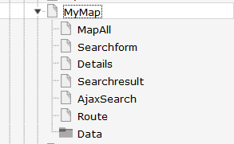
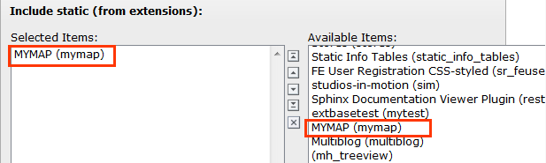

.. ==================================================
.. FOR YOUR INFORMATION
.. --------------------------------------------------
.. -*- coding: utf-8 -*- with BOM.

.. include:: ../Includes.txt

.. _admin-manual:

Administratormanual
====================

Target group: **Administrators**

Installation
^^^^^^^^^^^^
Import the extension from TER (TYPO3 Extension Repository) like any other extension.
Create some pages as shown below.

On the pages Single, Searchform, Autocompleter, Result and Route insert the suitable plugin of the extension. On page Single insert the plugin "search".
On page Result insert the plugin Search.

On page Mymap or on your root page insert Typoscript Include static (from extension) mymap.
With the constant editor insert the desired settings of the extension like Google maps options, your page ID's, 
jQuery options, path to templates etc. Traffic layer and bicycling layer could not be set both at the same time!

You have to get a 2 Google API keys. One as a Google Browser API key and one as a Google Server API key (for geocoding) from
here https://console.developers.google.com and insert them in the constants editor.
After fetching the keys you have to activate the Google Maps JavaScript API and the Google Maps Geocoding API.
When everything is working (geocoding and map display) you can restrict the browser key with http url and the
server key with ip address of the webserver to prevent illegal use of the keys.

The data of the locations and categories is stored in page Data. Insert in the constant editor
the correct "Default storage PID" of the locations.

Inserting data
^^^^^^^^^^^^^^
In TYPO3 list module select page Data. First insert some location categories.
Then you can insert some locations. You have not to insert the coordinates. The plugin
fetches the coordinates automatically from Google. To get this working, it is important that you insert
correct location data (city and country at least). If you don't insert some icon, the extension uses a default icon for the 
POI's.

When everything is done you can start a search in frontend.

Update script
^^^^^^^^^^^^^
The extension has an update script which migrates icon-, image- and media-files to FAL.
It is important to backup the database tables tx_mymap_domain_model_location and sys_file_reference before
executing the update script. To execute the update script you have to make a file named ENABLE_MYMAP_UPDATE_SCRIPT in
fileadmin. If this file is not found in fileadmin a hint is shown and no update is done.

Reference
^^^^^^^^^

.. _plugin-tx-mymap:

plugin.tx\_mymap.view
^^^^^^^^^^^^^^^^^^^^^

templateRootPath
""""""""""""""""

.. container:: table-row

   Property
         templateRootPath

   Data type
         string

   Description
         path to templates

   Default
         EXT:mymap/Resources/Private/Templates/

partialRootPath
""""""""""""""""

.. container:: table-row

   Property
         partialRootPath

   Data type
         string

   Description
         path to partials

   Default
         EXT:mymap/Resources/Private/Partials/
     
layoutRootPath
""""""""""""""

.. container:: table-row

   Property
         layoutRootPath

   Data type
         string

   Description
         path to layouts

   Default
         EXT:mymap/Resources/Private/Layouts/

     

plugin.tx\_mymap.settings
^^^^^^^^^^^^^^^^^^^^^^^^^

.. _googleBrowserApiKey:

googleBrowserApiKey
"""""""""""""""""""

.. container:: table-row

   Property
         Google Browser API Key

   Data type
         string

   Description
         Google Browser API key, get one here https://console.developers.google.com

   Default
         -

.. _googleServerApiKey:

googleServerApiKey
"""""""""""""""""""

.. container:: table-row

   Property
         Google Server API Key

   Data type
         string

   Description
         The Google Server API key is used for geocoding, get one here https://console.developers.google.com

   Default
         -

.. _enableTrafficLayer:

enableTrafficLayer
""""""""""""""""""

.. container:: table-row

   Property
         enableTrafficLayer

   Data type
         boolean

   Description
         Enables the traffic layer in the map

   Default
         -

.. _cssFile:

enableBicyclingLayer
""""""""""""""""""""

.. container:: table-row

   Property
         enableBicyclingLayer

   Data type
         boolean

   Description
         Enables the bicycling layer in the map. Only traffic- or bicyling layer are shown, not both together!

   Default
        -

enableStreetView
""""""""""""""""

.. container:: table-row

   Property
        enableStreetView

   Data type
         boolean

   Description
         Enables the streetview in the map.

   Default
        -

resultPageId
""""""""""""

.. container:: table-row

   Property
        resultPageId

   Data type
         int

   Description
         Id of the result page, especially when used with ajax search or search form insert the plugin search on the page with this id. Do not use the plugin singleView on this page.

   Default
        -

detailsPageId
"""""""""""""

.. container:: table-row

   Property
        resultPageId

   Data type
         int

   Description
         Id of the details page

   Default
        -

routePageId
"""""""""""

.. container:: table-row

   Property
        routePageId

   Data type
         int

   Description
         Id of the route page

   Default
        -

singleViewUid
"""""""""""""

.. container:: table-row

   Property
        singleViewUid

   Data type
        int

   Description
        Uid of the loaction record to be shown with the single view plugin.

   Default
        1

resultLimit
"""""""""""

.. container:: table-row

   Property
        resultLimit

   Data type
        int

   Description
        Limit the result to n records

   Default
        300

enableMarkerAnimation
"""""""""""""""""""""

.. container:: table-row

   Property
        enableMarkerAnimation

   Data type
         int

   Description
         If set to 1, markers are dropped down to the map

   Default
        0

enableMarkerClusterer
"""""""""""""""""""""

.. container:: table-row

   Property
        enableMarkerClusterer

   Data type
         int

   Description
         If set to 1, markers clusterer are shown (clustered POI's), especially in ajaxsearch plugin

   Default
        0

initialMapCoordinates
"""""""""""""""""""""

.. container:: table-row

   Property
        initialMapCoordintes

   Data type
         string

   Description
         Initial map coordinates [latitude,longitude]

   Default
        48,8

Known problems
^^^^^^^^^^^^^^

Do not use double quotes in fields, which are shown in the infoWindows, because this will break the javascript.

The extension uses heavily the $('....')-function of jQuery. So, make sure the
$-function is available and you do not use the noConflict-mode.

If something goes wrong with geocoding check the answers from Google with tools like firebug and check
the answers you get from from google in console or networking.

 
 
AjaxSearch
^^^^^^^^^^

Set the Default Storage Pid of the locations in the constant editor.

FAQ
^^^

*Custom templates and files*

You can use your own template and CSS file or other jQuery library - just go to the TYPO3 constants editor and change
the values for your needs.
