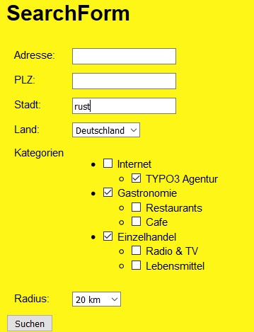
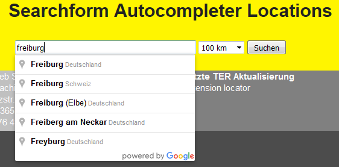
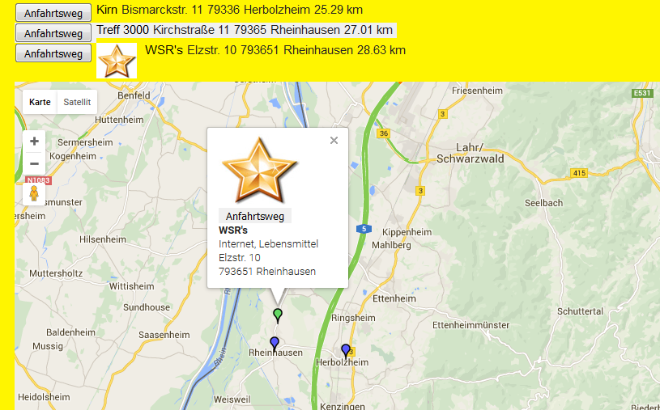
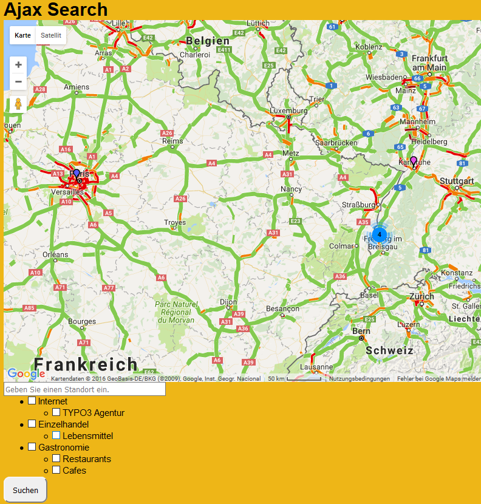
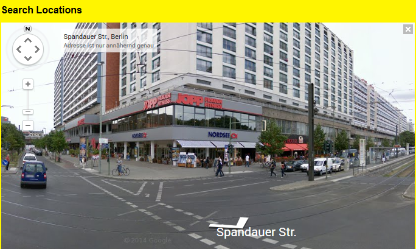
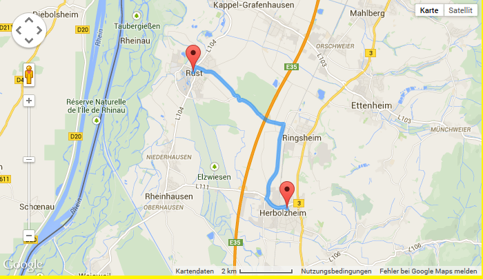
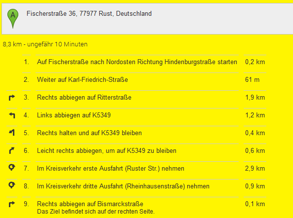

.. ==================================================
.. FOR YOUR INFORMATION
.. --------------------------------------------------
.. -*- coding: utf-8 -*- with BOM.

.. include:: ../Includes.txt

What does it do?
================

The extension enables you to do a radial search for locations and display them in a list and a responsive Google map with Google infoWindows. The driving
route to a location can be shown in Google maps too. The extension is based on multiple plugins. This way you can use more than one 
plugin of the extension on the same page. There are two searchforms, one with Google's autocompleter.
A single view of the location is implemented too, this can be used to display just a Google map without doing a search when the locationUid is given
in the constant editor of TYPO3. Google's streetview, traffic layer and bicycling layer can be activated too in the constant editor.

What's new?
^^^^^^^^^^^

Enabled for https protocol (Google API calls made with https). Namespaces implemented in MapJSViewhelpers (templates changed, output formatted raw). Three new fields (additionalname, additionaladdress and additionalcontact) implemented.
Hierachical categories implemented. The extension works now with two Google API keys, a Google Browser API key and a Google Server API key. The Server API key
is used for geocoding of locations, especially for searching coordinates in the AjaxSearch plugin and for geocoding data records 
which have no coordinates. MarkerClusterer implemented, you can activate this option via constant editor.
The ajaxSearch shows n=resultLimit locations in the map when the page is loaded. Other 
locations are loaded by lazy loading and a show more button at the end of the page. The ajaxSearch works with the Google autocompleter.
Location categories implemented to limit the searches.
Plugin ajaxSearch implemented, new configuration option enableSearchCircle for ajaxSearch.
The POIs (Points of Interest) are animated when they are shown in the map. 
The configuration of the extension is done with the constant editor or with typoscript.

Screenshots
___________

**Search form** 

**Search form with autocompleter** 

**Search result with Google map** 

**Ajax search result** 

**Google's streetview** 

**Route view with Google map** 

    
**Route description** 

    

    

