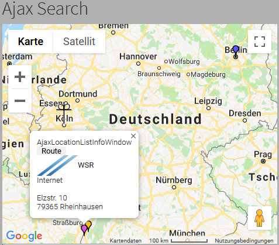

# mymap

#### Google maps for your TYPO3 website

What does it do
---------------

Google maps with radial search and hierarchic categories (category tree).
Show the results in responsive Google maps, traffic- and bicycling layer included and can be activated via constant editor.

#### Plugin AjaxSearch with Google infoWindow

[Introduction](https://github.com/joachimruhs/mymap/blob/master/Documentation/Introduction/Index.rst "Introduction")

For installation see the administrator manual

[Administrator Manual](https://github.com/joachimruhs/mymap/blob/master/Documentation/AdministratorManual/Index.rst "Administrator Manual")

Markiert Text als `Inline-Quelltext`

Ein normaler Absatz

    Ein Code-Block
    durch Einrückung
    mit vier Leerzeichen
	
	
* Ein Punkt in einer ungeordneten Liste
* Ein weiterer Punkt in einer ungeordneten Liste
    * Ein Unterpunkt, um vier Leerzeichen eingerückt
* Statt * funktionieren auch + oder -

So oder so kann es gehen.